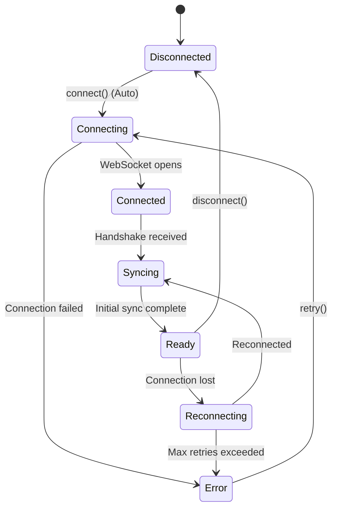

# nMeshed JavaScript/TypeScript SDK

> **"Postgres for Realtime"** — Contract-grade state synchronization for web applications.

[](https://www.npmjs.com/package/nmeshed)
[](https://www.typescriptlang.org/)
[](./LICENSE)

The official browser-ready client for [nMeshed](https://nmeshed.com). Powered by **nmeshed-core (WASM)**, providing industry-standard Automerge CRDTs for robust, offline-first multiplayer sync.

---

## ⚡️ Quick Start (Zen API)

Get multiplayer state in your React app in under 2 minutes using `useSyncSession`.

### 1. Install

```bash
npm install nmeshed
# or
yarn add nmeshed
```

### 2. The Mechanics

nMeshed enables **Server-Authoritative Synchronization** with **Optimistic Local Updates**.
No explicit "connect" call is needed. The hook handles the lifecycle.

```tsx
// App.tsx
import { useSyncSession } from 'nmeshed/react';

export default function App() {
  // 1. Initialize Session (Auto-connects)
  const { client, isReady, status } = useSyncSession({
    workspaceId: 'my-room-123',
    apiKey: 'nm_live_xyz' // Or token: '...'
  });

  if (!isReady) return <div>Connecting ({status})...</div>;

  return <Game client={client} />;
}

function Game({ client }: { client: NMeshedClient }) {
  // 2. Use State
  const [count, setCount] = useState(client.get<number>('count') || 0);

  useEffect(() => {
    // 3. Listen for changes (Atomic Updates)
    return client.on('op', (key, val) => {
      if (key === 'count') setCount(val as number);
    });
  }, [client]);

  return (
    <button onClick={() => client.set('count', count + 1)}>
      Count: {count}
    </button>
  );
}
```

Open in two browser windows. Click the button in one — it updates in both.

---

## 🔌 Connection Lifecycle

Understanding how the SDK connects helps you debug issues faster.



### Status Types

| Status | Meaning | What to Do |
|--------|---------|------------|
| `disconnected` | Not connected | Check config or call manual `connect()` |
| `connecting` | WebSocket opening | Wait (< 3 seconds) |
| `connected` | WS open, awaiting handshake | Wait (< 1 second) |
| `syncing` | Receiving initial state | Wait (< 5 seconds for large workspaces) |
| `ready` | Fully operational | 🚀 Start rendering UI |
| `reconnecting` | Connection lost, retrying | Auto-retries with exponential backoff |
| `error` | Unrecoverable failure | Check config, network, or server |

---

## 🧠 Core Concepts

### State vs. Signal

| Use Case | Tool | Persisted? | Frequency |
|----------|------|------------|-----------|
| **Document State** | `client.set(key, val)` | ✅ Yes | Low-Medium (Save edits) |
| **Ephemeral Events** | `client.sendMessage(payload)` | ❌ No | High (Cursors, Typing) |
| **Presence** | `useSyncSession().peers` | ❌ No | Low (Online list) |

### The "Zen" Philosophy
1.  **Invisible**: The user should never see a loading spinner after the initial load.
2.  **Optimistic**: Local changes apply instantly (0ms latency).
3.  **Authoritative**: The Server is the source of truth if conflicts occur.

---

## 🛠 Usage Patterns

### Pattern A: Provider (Recommended for Large Apps)
For complex apps where the client needs to be accessed deeply in the tree.

```tsx
// 1. Wrap Root
<NMeshedProvider config={{ workspaceId: 'room', apiKey: '...' }}>
  <Dashboard />
</NMeshedProvider>

// 2. Consume Deeply
function Widget() {
  const { client } = useNmeshedContext();
  // ...
}
```

### Pattern B: Schema-Driven Data
For type-safe, validated structures.

```tsx
import { defineSchema } from 'nmeshed';
import { useStore } from 'nmeshed/react';

const TodoSchema = defineSchema({
  id: 'string',
  text: 'string',
  done: 'boolean'
});

function TodoItem({ id }) {
  // Auto-validates and types the return value
  const [todo, setTodo, { isConnected }] = useStore(TodoSchema);
  
  if (!isConnected) return <span>Connecting...</span>;

  return <div onClick={() => setTodo({ ...todo, done: !todo.done })} />;
}
```

---

## 🚨 Troubleshooting

### Quick Diagnostic Checklist

Before diving into specific errors, verify these first:

```bash
# 1. Is the server running?
curl http://localhost:8080/healthz
# Expected: "OK"

# 2. Is your token valid? (Decode it)
echo "YOUR_TOKEN" | cut -d. -f2 | base64 -d 2>/dev/null
# Expected: JSON with "sub" and "workspace" fields
```

### Common Symptoms

#### 1. "WebSocket connection failed"
*   **Cause**: Server not running or wrong port.
*   **Fix**: Ensure `serverUrl` matches your server (default `wss://api.nmeshed.com` or `ws://localhost:8080`).

#### 2. "Auth Rejected"
*   **Cause**: Invalid Token or incorrect Secret.
*   **Fix**: Check `NMESHED_JWT_SECRET` in server `.env` aligns with your token generator.

#### 3. "RuntimeError: unreachable" (WASM Panic)
*   **Cause**: The Rust core crashed.
*   **Fix**:
    1.  Rebuild WASM: `cd platform/core/rust && wasm-pack build --target web --dev`
    2.  Check browser console for Rust stack trace.
    3.  File an issue.

---

## 🔧 Configuration Reference

```typescript
interface NMeshedConfig {
  // Required
  workspaceId: string;
  token?: string;       // JWT
  apiKey?: string;      // Alternative to token

  // Advanced
  relayUrl?: string;    // Custom server URL
  userId?: string;      // Explicit user ID
  debug?: boolean;      // Verbose logging
}
```

## 🧪 Testing

We provide a dedicated testing utility to simplify unit testing of your React components.

```tsx
import { render, screen } from '@testing-library/react';
import { MockNMeshedProvider } from 'nmeshed/react';
import { MyComponent } from './MyComponent';

test('renders with mock data', () => {
  render(
    <MockNMeshedProvider 
      status="CONNECTED" 
      storeData={{ count: 42 }}
    >
      <MyComponent />
    </MockNMeshedProvider>
  );
  
  expect(screen.getByText('Count: 42')).toBeInTheDocument();
});
```

## 📚 Resources

- [**Internal Docs**](../../internal-docs): For contributors.
- [**Examples**](../../examples): Full working demos.

