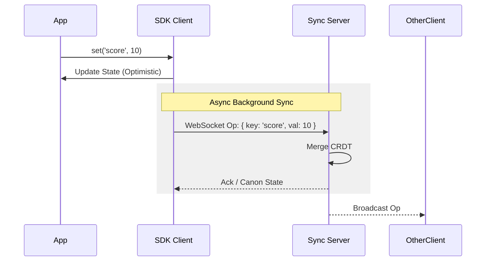

# nMeshed JavaScript/TypeScript SDK

The official browser-ready client for [nMeshed](https://nmeshed.com). Add multiplayer sync, live cursors, and collaborative state to any JavaScript application in minutes.

[](https://www.npmjs.com/package/nmeshed)
[](https://www.typescriptlang.org/)
[](./LICENSE)

---

## Architecture

nMeshed uses a **client-authoritative synchronization model** powered by Conflict-Free Replicated Data Types (CRDTs). This means:

1.  **Optimistic UI**: Local changes are applied immediately. You never wait for the server.
2.  **Eventual Consistency**: The server merges changes from all clients and broadcasts the canonical state.
3.  **Offline-Capable**: Operations queue up when offline and sync automatically upon reconnection.



---

## Installation

```bash
npm install nmeshed
# or
yarn add nmeshed
```

---

## Quick Start (React)

The React integration is the recommended way to use nMeshed in modern web apps. It leverages `Context` to manage the WebSocket connection efficiently.

### 1. Setup the Provider

Wrap your application root. You will need a JWT signed by your backend (see [Authentication](#authentication)).

```tsx
// App.tsx
import { NMeshedProvider } from 'nmeshed/react';

const config = {
  workspaceId: 'room-123',
  token: 'YOUR_JWT_TOKEN',
  // Optional: Override URL for local dev
  // serverUrl: 'ws://localhost:8080/v1/sync' 
};

export default function App() {
  return (
    <NMeshedProvider config={config}>
      <GameCanvas />
    </NMeshedProvider>
  );
}
```

### 2. Use Shared State

Use the `useDocument` hook to read and write to the shared state. It forces a re-render *only* when the specific key changes.

```tsx
// GameCanvas.tsx
import { useDocument } from 'nmeshed/react';

export function GameCanvas() {
  // Generics provide strict typing for the value
  const { value: score, setValue: setScore } = useDocument<number>({
    key: 'player_score',
    initialValue: 0
  });

  return (
    <button onClick={() => setScore((score || 0) + 1)}>
      Score: {score}
    </button>
  );
}
```

### 3. Presence & Signals (New in 2.0)

For high-frequency ephemeral data (like cursor positions) or status updates, use the Presence API. This data bypasses the database for maximum performance.

**Real-time Users:**
```tsx
import { usePresence, AvatarStack } from 'nmeshed/react';

function Header() {
  const users = usePresence(); 
  return <AvatarStack />; // Automatic UI
}
```

**Broadcasting Signals (Cursors, Typing):**
```tsx
import { useBroadcast } from 'nmeshed/react';

function Canvas() {
  const broadcast = useBroadcast();
  
  const onMove = (e) => {
    // Throttling is handled automatically by the component, 
    // but raw broadcast sends immediately.
    broadcast({ type: 'cursor', x: e.clientX, y: e.clientY });
  };

  return <div onMouseMove={onMove} />;
}
```

### 4. Visual Components

Drop-in components for common collaborative patterns.

```tsx
import { LiveCursors, AvatarStack } from 'nmeshed/react';

function App() {
  return (
    <>
      <LiveCursors /> {/* Renders multiplayer cursors overlay */}
      <nav>
        <AvatarStack /> {/* Shows online user bubbles */}
      </nav>
      {/* ... app content ... */}
    </>
  );
}
```

---

## Performance Guide: State vs. Signal

To scale to 1,000+ users, choose the right tool:

| Feature | Tool | Why? |
|---|---|---|
| **Inventory, Documents, Chat** | `useDocument()` | Needs persistence, history, and offline sync (CRDTs). |
| **Cursors, Typing, Selection** | `useBroadcast()` | High frequency (60fps), okay to drop if late. Bypasses DB. |
| **Online Status** | `usePresence()` | Real-time awareness of who is connected. |

**Rule of Thumb**: If it needs to be there when I refresh the page, use `useDocument`. If it's just for "now," use `useBroadcast`.

---

## Handle Connection Status

User feedback is critical for real-time apps. Always show the connection state.

```tsx
import { useStatus } from 'nmeshed/react';

export function ConnectionIndicator() {
  const status = useStatus(); // 'CONNECTING' | 'CONNECTED' | 'DISCONNECTED' | 'ERROR'

  if (status === 'ERROR') return <Badge color="red">Connection Failed</Badge>;
  if (status === 'CONNECTING') return <Badge color="yellow">Reconnecting...</Badge>;
  return <Badge color="green">Live</Badge>;
}
```

---

## Authentication

nMeshed requires a signed JWT for every connection. **Do not embed secrets in your frontend code.**

1.  **Your Backend** generates a JWT using your `NMESHED_JWT_SECRET`.
2.  **Your Frontend** fetches this token via an API call before initializing the `NMeshedProvider`.

### Generating a Token (Node.js Example)

```typescript
import jwt from 'jsonwebtoken';

const token = jwt.sign({
  sub: 'user_123',           // Unique User ID
  workspace_id: 'room-abc',  // The room they are joining
  role: 'editor'             // Permissions
}, process.env.NMESHED_JWT_SECRET, { expiresIn: '1h' });
```

---

## Advanced Usage

### Direct Client Access (Vanilla JS)

For use outside of React (e.g., in a game engine like Phaser or Three.js), use the `NMeshedClient` directly.

```typescript
import { NMeshedClient } from 'nmeshed';

const client = new NMeshedClient({
  workspaceId: 'game-lobby',
  token: 'TOKEN',
  autoReconnect: true
});

await client.connect();

// Listen for ALL changes (useful for logging/debugging)
client.onMessage((msg) => {
  if (msg.type === 'op') {
    console.log(`Key ${msg.payload.key} changed to`, msg.payload.value);
  }
});

// Update state
client.set('player_1_pos', { x: 10, y: 20 });
```

### Typing Your Schema

For TypeScript projects, define a global schema interface to enforce type safety across your entire application.

```typescript
// types.ts
export interface GameSchema {
  score: number;
  players: Record<string, Player>;
  isGameOver: boolean;
}

// component.tsx
// Using the key ensures 'score' is treated as a number
const { value } = useDocument<GameSchema['score']>({ key: 'score' });
```

---

## Troubleshooting

### `useEffect` Double-Mount in React Strict Mode
**Symptom**: You see two WebSocket connections opening in development.
**Cause**: React Strict Mode mounts components twice to find bugs.
**Fix**: `NMeshedProvider` handles this automatically, but if you effectively create your own client in a `useEffect`, ensure you return a cleanup function:
```typescript
useEffect(() => {
  client.connect();
  return () => client.disconnect(); // <--- Crucial
}, []);
```

### Connection Refused (WebSocket)
**Symptom**: `WebSocket connection to 'ws://...' failed`
**Checks**:
1.  Is the sync server running? (`curl http://localhost:8080/healthz`)
2.  Are you using the correct port? Default is `8080`.
3.  Are you mixing secure (`wss://`) and insecure (`ws://`)? Localhost usually requires `ws://`.

---

## API Reference

### `NMeshedConfig`

| Property | Type | Required | Description |
|---|---|---|---|
| `workspaceId` | `string` | **Yes** | The unique identifier for the room/document. |
| `token` | `string` | **Yes** | Signed JWT. |
| `serverUrl` | `string` | No | Defaults to production cloud. |
| `autoReconnect` | `boolean` | No | Defaults to `true`. |
| `debug` | `boolean` | No | Enables verbose console logs. |

### `useDocument<T>(options)`

| Property | Type | Required | Description |
|---|---|---|---|
| `key` | `string` | **Yes** | The dot-notation path to the data key. |
| `initialValue` | `T` | No | Value to return before data loads. |

### `usePresence()`

Returns an array of `PresenceUser` objects representing currently online users.

### `useBroadcast(handler?)`

Returns a `broadcast(payload: any)` function. Optionally accepts a handler for incoming broadcasts.
