# nMeshed JavaScript/TypeScript SDK

> **"Postgres for Realtime"** — Contract-grade state synchronization for web applications.

[](https://www.npmjs.com/package/nmeshed)
[](https://www.typescriptlang.org/)
[](./LICENSE)

The official browser-ready client for [nMeshed](https://nmeshed.com). Powered by **nmeshed-core (WASM)**, providing industry-standard Automerge CRDTs for robust, offline-first multiplayer sync.

---

## ⚡️ Quick Start (React)

Get multiplayer state in your React app in under 5 minutes.

### 1. Install

```bash
npm install nmeshed
# or
yarn add nmeshed
```

### 2. Setup the Provider

Wrap your application root with `NMeshedProvider`:

```tsx
// App.tsx
import { NMeshedProvider } from 'nmeshed/react';

const config = {
  workspaceId: 'my-room-id',
  token: 'YOUR_JWT_TOKEN', // From your backend (see Authentication below)
};

export default function App() {
  return (
    <NMeshedProvider config={config}>
      <MyComponent />
    </NMeshedProvider>
  );
}
```

### 3. Use Shared State

```tsx
// Counter.tsx
import { useDocument } from 'nmeshed/react';

export function Counter() {
  const { value: count, setValue: setCount } = useDocument<number>({
    key: 'shared_counter',
    initialValue: 0,
  });

  return (
    <button onClick={() => setCount((count || 0) + 1)}>
      Count: {count}
    </button>
  );
}
```

Open in two browser windows. Click the button in one — it updates in both.

---

## 🔌 Connection Lifecycle

Understanding how the SDK connects helps you debug issues faster.


### Status Types

| Status | Meaning | What to Do |
|--------|---------|------------|
| `disconnected` | Not connected | Call `connect()` or check config |
| `connecting` | WebSocket opening | Wait (< 3 seconds) |
| `connected` | WS open, awaiting handshake | Wait (< 1 second) |
| `syncing` | Receiving initial state | Wait (< 5 seconds for large workspaces) |
| `ready` | Fully operational | 🚀 You're good! |
| `reconnecting` | Connection lost, retrying | Auto-retries with exponential backoff |
| `error` | Unrecoverable failure | Check config, network, or server |

---

## 🧠 Core Concepts

### State vs. Signal: Choose the Right Tool

| Use Case | Tool | Persisted? | Frequency |
|----------|------|------------|-----------|
| Documents, Chat, Inventory | `useDocument()` | ✅ Yes | Low-Medium |
| Cursors, Typing Indicators | `useBroadcast()` | ❌ No | High (60fps OK) |
| "Who is online?" | `usePresence()` | ❌ No | Low |

**Rule of thumb**: If losing the data would be a bug, use `useDocument()`. If it's ephemeral UI state, use `useBroadcast()`.

---

## 🛠 Usage Examples

### Schema-Driven State with `useStore`

For complex data models, use `defineSchema` for type-safe, auto-serialized state:

```tsx
import { defineSchema } from 'nmeshed';
import { useStore } from 'nmeshed/react';

// Define your data model
const TaskSchema = defineSchema({
  id: 'string',
  title: 'string',
  completed: 'boolean',
  assignee: 'string',
});

function TaskItem({ taskId }: { taskId: string }) {
  const [task, setTask] = useStore(TaskSchema, `tasks:${taskId}`);

  const toggleComplete = () => {
    setTask({ ...task, completed: !task.completed });
  };

  return (
    <div onClick={toggleComplete}>
      {task.completed ? '✅' : '⬜'} {task.title}
    </div>
  );
}
```

---

### Local Development (No Cloud)

For local development without authentication:

**Option 1: Magic prefix (zero config)**
```tsx
const config = {
  workspaceId: 'my-room',
  apiKey: 'nm_local_dev',  // Auto-routes to localhost:8080
};
```

**Option 2: Explicit URL**
```tsx
const config = {
  workspaceId: 'my-room',
  token: 'dev-token',
  serverUrl: 'ws://localhost:8080/v1/sync',
};
```

> [!NOTE]
> The local server must be running with `AUTH_BYPASS_DEV=true`. See [Onboarding Guide](../../internal-docs/guides/onboarding.md).

---

### Direct Client Access (Vanilla JS / Game Engines)

For Phaser, Three.js, Pixi.js, or non-React apps:

```typescript
import { NMeshedClient } from 'nmeshed';

const client = new NMeshedClient({
  workspaceId: 'game-lobby',
  token: 'YOUR_TOKEN',
  serverUrl: 'wss://api.nmeshed.com/v1/sync',
});

// Connect and wait for ready state
await client.connect();

// Listen for state changes
client.onMessage((msg) => {
  if (msg.type === 'op') {
    console.log(`Key ${msg.payload.key} changed to:`, msg.payload.value);
    updateGameState(msg.payload.key, msg.payload.value);
  }
});

// Write state
client.set('player:123:position', { x: 100, y: 200 });

// Clean up
window.addEventListener('beforeunload', () => {
  client.disconnect();
});
```

---

### Presence (Who's Online?)

```tsx
import { usePresence } from 'nmeshed/react';

function OnlineUsers() {
  const { users, updateMyPresence } = usePresence();

  // Update your cursor position
  useEffect(() => {
    const handleMove = (e: MouseEvent) => {
      updateMyPresence({ x: e.clientX, y: e.clientY });
    };
    window.addEventListener('mousemove', handleMove);
    return () => window.removeEventListener('mousemove', handleMove);
  }, [updateMyPresence]);

  return (
    <div>
      {users.map((user) => (
        <Cursor key={user.id} x={user.x} y={user.y} name={user.name} />
      ))}
    </div>
  );
}
```

---

## 🔐 Authentication

### How It Works

```mermaid
sequenceDiagram
    participant Browser
    participant Your Backend
    participant nMeshed

    Browser->>Your Backend: GET /api/nmeshed-token
    Your Backend->>Your Backend: Sign JWT with NMESHED_SECRET
    Your Backend-->>Browser: { token: "eyJ..." }
    Browser->>nMeshed: Connect with token
    nMeshed->>nMeshed: Verify signature
    nMeshed-->>Browser: Connected ✅
```



### Backend Token Generation (Node.js Example)

```typescript
// api/nmeshed-token.ts
import jwt from 'jsonwebtoken';

export async function GET(req: Request) {
  const user = await getUser(req); // Your auth logic
  
  const token = jwt.sign(
    {
      sub: user.id,           // Required: User identifier
      workspace: req.query.workspace,  // Required: Room ID
    },
    process.env.NMESHED_SECRET,       // From nMeshed dashboard
    { expiresIn: '1h' }
  );

  return Response.json({ token });
}
```

---

## 🚨 Troubleshooting

### Quick Diagnostic Checklist

Before diving into specific errors, verify these first:

```bash
# 1. Is the server running?
curl http://localhost:8080/healthz
# Expected: "OK"

# 2. Is your token valid? (Decode it)
echo "YOUR_TOKEN" | cut -d. -f2 | base64 -d 2>/dev/null
# Expected: JSON with "sub" and "workspace" fields
```

---

### Error: `WebSocket connection to 'ws://...' failed`

**What's happening**: The browser cannot establish a connection to the server.

**Likely causes & fixes**:

| Check | Command/Action | Expected |
|-------|----------------|----------|
| Server running? | `curl http://localhost:8080/healthz` | Returns `OK` |
| Correct port? | Check `serverUrl` in config | Port matches server |
| Mixed security? | Check browser console | Use `wss://` on HTTPS sites |

**Common fix**: You're using `ws://` from an `https://` page. Browsers block this.
```tsx
// Wrong: Mixed protocols
serverUrl: 'ws://localhost:8080/v1/sync'  // From https:// page

// Right: Match the protocol
serverUrl: 'wss://api.nmeshed.com/v1/sync'  // For https:// pages
serverUrl: 'ws://localhost:8080/v1/sync'    // For http:// pages (local dev only)
```

---

### Error: `auth_rejected`

**What's happening**: The token signature is invalid.

**Likely causes & fixes**:

| Problem | How to Verify | Fix |
|---------|---------------|-----|
| Wrong secret | Decode token at [jwt.io](https://jwt.io) | Ensure backend uses same secret as dashboard |
| Token expired | Check `exp` claim in payload | Generate fresh token |
| Missing claims | Decode token, check for `sub` | Add required claims in backend |

**Debug command**:
```bash
# Decode your token's payload
echo "YOUR_TOKEN" | cut -d. -f2 | base64 -d 2>/dev/null | jq .
```

**Expected output**:
```json
{
  "sub": "user-123",
  "workspace": "room-abc",
  "iat": 1703620000,
  "exp": 1703623600
}
```

---

### Error: `RuntimeError: unreachable` (WASM Panic)

**What's happening**: The Rust WASM core hit an unrecoverable error.

**How to get a readable stack trace**:

1. Rebuild WASM in debug mode:
   ```bash
   cd platform/core/rust
   wasm-pack build --target web --dev --out-dir ../../../sdks/javascript/src/wasm/pkg
   ```

2. Rebuild your app and reload. The error will now show the Rust file and line number.

---

### Issue: React `useEffect` Creates Double Connections

**What's happening**: React Strict Mode mounts components twice in development.

**The fix**: `NMeshedProvider` handles this automatically. If using `NMeshedClient` directly, ensure cleanup:

```tsx
useEffect(() => {
  const client = new NMeshedClient(config);
  client.connect();

  return () => {
    client.disconnect();  // ← Critical: cleanup on unmount
  };
}, []);
```

---

### Issue: State Not Syncing Between Clients

**Diagnostic steps**:

1. **Check both clients are ready**:
   ```tsx
   const { status } = useConnection();
   console.log('Status:', status);  // Should be 'ready'
   ```

2. **Check they're in the same workspace**:
   ```tsx
   console.log('Workspace:', config.workspaceId);  // Must match
   ```

3. **Check browser DevTools Network tab**:
   - Filter by `WS`
   - Click the WebSocket connection
   - Messages tab should show binary blobs (not JSON text)

4. **If you see JSON text instead of binary**: Your SDK is outdated.
   ```bash
   npm update nmeshed
   ```

---

## 🔧 Configuration Reference

```typescript
interface NMeshedConfig {
  // Required
  workspaceId: string;        // Room/document identifier
  token: string;              // JWT from your backend

  // Optional
  serverUrl?: string;         // Default: wss://api.nmeshed.com/v1/sync
  userId?: string;            // Auto-generated if not provided
  reconnectMaxRetries?: number;  // Default: 10
  reconnectBaseDelay?: number;   // Default: 1000 (ms)
  debug?: boolean;            // Default: false (logs to console)
}
```

---

## 📊 Version Compatibility

| SDK Version | Server Version | Node.js | Browsers |
|-------------|----------------|---------|----------|
| 1.x | 1.x | 18+ | Chrome 90+, Firefox 90+, Safari 15+, Edge 90+ |
| 0.x | 0.x | 16+ | Legacy (not recommended) |

---

## 📚 More Resources

- **[API Reference](https://docs.nmeshed.com/api)**: Complete method signatures
- **[Examples](../../examples)**: Full working apps (Kanban, Cursors, Factory Mesh)
- **[Internal Docs](../../internal-docs)**: Architecture and onboarding (for contributors)

---

## 📞 Getting Help

If you're stuck:

1. **Check the troubleshooting section above**
2. **Search existing [GitHub Issues](https://github.com/nmeshed/nmeshed/issues)**
3. **Open a new issue** with:
   - SDK version (`npm list nmeshed`)
   - Browser and version
   - Minimal reproduction code
   - Full error message with stack trace
